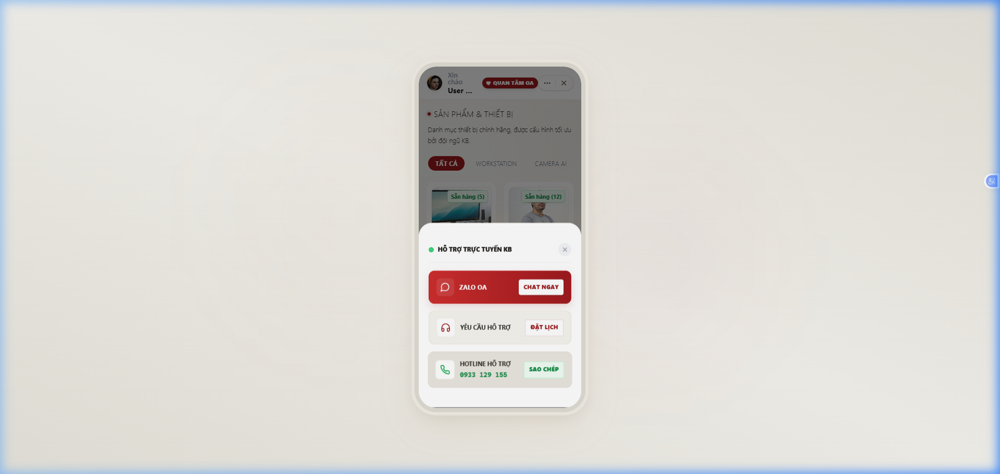

# 🌟 KB Zalo Mini App (ZaloMiniApp-KB)

<p align="center">
  <pre>
  🔴      🔴    ⚫⚫⚫⚫⚫⚫  
  🔴    🔴      ⚫          ⚫ 
  🔴  🔴        ⚫⚫⚫⚫⚫⚫  
  🔴🔴          ⚫          ⚫ 
  🔴  🔴        ⚫          ⚫ 
  🔴    🔴      ⚫          ⚫ 
  🔴      🔴    ⚫⚫⚫⚫⚫⚫  
  </pre>
</p>

> Một ứng dụng Zalo Mini App cao cấp, hiện đại và sang trọng (Editorial Luxury Light theme) được tích hợp các công nghệ WebGL (Three.js), hiệu ứng chuyển động mượt mà (Motion/React) và Zalo Mini Program SDK.

<p align="center">
  
  
  
  
</p>

---

## 🎨 Điểm Nổi Bật Về Thiết Kế & Trải Nghiệm

*   **Cinematic WebGL Intro**: Màn hình mở đầu ấn tượng với không gian 3D tương tác sử dụng **Three.js** cùng logo KB tối giản sang trọng.
*   **Luxury Editorial Aesthetic**: Thiết kế giao diện theo phong cách tạp chí cao cấp với gam màu trắng kem, đỏ ruby và vàng gold tạo cảm giác đắt giá và chuyên nghiệp.
*   **Hiệu Ứng Micro-Animations**: Sử dụng `motion/react` cho các chuyển động mượt mà, bao gồm hiệu ứng bay vào giỏ hàng (fly-to-cart particles) độc đáo.
*   **Tích hợp Zalo SDK**: Nhận dạng thông tin người dùng Zalo (tên, avatar, số điện thoại) một cách liền mạch.
*   **Hỗ trợ đa dạng nền tảng**: Tự động chuyển đổi giữa giao diện mô phỏng thiết bị di động (iPhone 13 Premium Mockup) trên máy tính và chế độ tràn màn hình native trên điện thoại/Zalo App.

---

## 🛠️ Công Nghệ Sử Dụng

*   **Core**: React 18 & TypeScript (tsconfig cấu hình chuẩn hóa)
*   **Build Tool**: Vite 5.4+ & ZMP Vite Plugin 1.1+ (tự động sao chép config đặc thù Zalo Mini App)
*   **Styling**: Tailwind CSS v4 & Lucide Icons
*   **Graphics & Motion**: Three.js & Motion/React (Framer Motion v12)
*   **Integration**: Zalo Mini Program SDK (`zmp-sdk`)

---

## 📂 Cấu Trúc Thư Mục Dự Án

```text
├── .agents/              # Skill/Quy tắc hỗ trợ của trợ lý AI
├── src/
│   ├── assets/           # Tài nguyên hình ảnh, logo SVG
│   ├── api/              # API Client (xử lý kho hàng/dịch vụ)
│   ├── components/       # Các thành phần giao diện dùng chung (Header, ThreeIntro, v.v.)
│   ├── config/           # Cấu hình Zalo Mini App
│   ├── pages/            # Các trang chính (index, services, inventory, contact)
│   ├── App.tsx           # Thành phần chính định tuyến và quản lý trạng thái
│   └── main.tsx          # Điểm đầu vào (entry point) ứng dụng
├── www/                  # Thư mục chứa bản build sẵn sàng triển khai
├── app-config.json       # Tệp cấu hình ứng dụng Zalo Mini App bắt buộc
├── vite.config.ts        # Cấu hình Vite tích hợp Zalo Mini App plugin
└── package.json          # Danh sách thư viện và tập lệnh chạy dự án
```

---

## 🚀 Hướng Dẫn Cài Đặt & Chạy Dự Án

### 1. Chuẩn Bị
Đảm bảo bạn đã cài đặt NodeJS trên máy tính.

### 2. Cài Đặt Thư Viện
Mở terminal tại thư mục dự án và chạy:
```bash
npm install
```

> [!TIP]
> **Nếu gặp lỗi cài đặt (EPERM hoặc thiếu thư viện `react-refresh`):**
> Hãy chạy chuỗi lệnh sau để dọn dẹp bộ nhớ đệm và cài đặt lại một cách sạch sẽ:
> ```bash
> npm cache clean --force
> npm install react-refresh --save-dev
> npm install
> ```

### 3. Chạy Chế Độ Phát Triển (Local Development)
Khởi động máy chủ local để xem giao diện ứng dụng:
```bash
npm run dev
```
Ứng dụng sẽ được khởi tạo tại cổng mặc định `http://localhost:3000`.

### 4. Build Ứng Dụng (Production Build)
Để đóng gói ứng dụng đưa lên Zalo Mini App Studio hoặc triển khai thực tế:
```bash
npm run build
```
Bản build hoàn chỉnh sẽ nằm trong thư mục `/www` (bao gồm cả tệp cấu hình `app-config.json`).

---

## 📤 Hướng Dẫn Push Code Lên GitHub

Nếu bạn muốn cập nhật dự án hoặc đẩy lên kho lưu trữ mới, hãy sử dụng các lệnh Git tiêu chuẩn:

1. **Khởi tạo và thêm file**:
   ```bash
   git init
   git add .
   git commit -m "Initial commit with premium README"
   ```

2. **Cấu hình remote (Nếu chưa liên kết)**:
   ```bash
   git remote add origin https://github.com/Quan111-ai/ZaloMiniApp-KB.git
   git branch -M main
   ```

3. **Push lên GitHub** (Sử dụng `--force` nếu kho lưu trữ GitHub của bạn bị xung đột lịch sử khởi tạo):
   ```bash
   git push -u origin main --force
   ```

---
*Bản quyền ứng dụng và thiết kế thuộc về Admin KB. Vận hành chính thức trên nền tảng Zalo Mini Program.*
